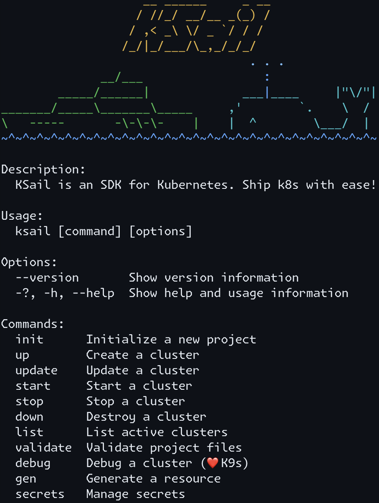

[](https://opensource.org/licenses/Apache-2.0)
[](https://pkg.go.dev/github.com/devantler-tech/ksail/v5)
[](https://codecov.io/gh/devantler-tech/ksail)
[](https://github.com/devantler-tech/ksail/actions/workflows/ci.yaml)

# 🛥️🐳 KSail



KSail is a CLI tool that bundles common Kubernetes tooling into a single binary. It provides one consistent interface to create clusters, deploy workloads, and operate cloud-native stacks across different distributions.

## Why?

Setting up and operating Kubernetes clusters is a skill of its own, often requiring juggling multiple CLI tools, writing bespoke scripts, and dealing with inconsistent developer workflows, all determined by the specific project. This complexity and inconsistency slow down development, make Kubernetes hard for newcomers, and make it difficult to maintain reproducible environments and ways of working. KSail removes the tooling overhead so you can focus on your workloads.

## Key Features

📦 **One Binary** — Embeds cluster provisioning, GitOps engines, and deployment tooling. No tool sprawl.

☸️ **Simple Clusters** — Spin up Kind, K3d, or Talos clusters with one command. Same workflow across supported distributions and providers.

📄 **Everything as Code** — Cluster settings, distribution configs, and workloads all live in version-controlled files.

🔄 **GitOps Native** — Opt into Flux or ArgoCD. KSail handles the bootstrap and gives you push and reconcile commands.

⚙️ **Customizable Stack** — Select your CNI, CSI, enable cert-manager, add mirror registries to match your setup.

🔐 **SOPS Built In** — Encrypt, decrypt, and edit secrets with integrated cipher commands.

## Getting Started

### Prerequisites

The binary works on all major operating systems and modern CPU archectures:

| OS                   | Arch            |
|----------------------|-----------------|
| 🐧 Linux             | amd64 and arm64 |
|  MacOS              | arm64           |
| ⊞ Windows (untested) | amd64 and arm64 |

The supported distributions depend on different local and cloud providers:

| Distribution | Provider                  |
|--------------|---------------------------|
| Kind         | Docker                    |
| K3d          | Docker                    |
| Talos        | Docker, Hetzner (🚧 next) |
| EKS          | Docker (🚧 next)          |

### Installation

#### Homebrew

```bash
brew install --cask devantler-tech/tap/ksail
```

#### Go install

```bash
go install github.com/devantler-tech/ksail/v5@latest
```

## Usage

```bash
# 1. Initialize a new project with your preferred stack
ksail cluster init \
  --distribution <Kind|K3d|Talos> \
  --cni <Default|Cilium|Calico|None> \
  --csi <Default|LocalPathStorage|None> \
  --metrics-server <Default|Enabled|Disabled> \
  --cert-manager <Enabled|Disabled> \
  --gitops-engine <None|Flux|ArgoCD> \
  --mirror-registry <host>=<upstream>

# 2. Create and start the cluster
ksail cluster create

# Add your manifests to a k8s/kustomization.yaml file

# 3. Deploy your workloads
ksail workload apply -k ./k8s   # for kubectl workflows
ksail workload reconcile        # for gitops workflows

# 4. Connect to the cluster with k9s
ksail cluster connect
```

## Documentation

### For users

- Browse the documentation in [`docs/`](./docs/index.md) (Markdown) or on <https://ksail.devantler.tech> (GitHub Pages).

### For contributors

- [CONTRIBUTING.md](./CONTRIBUTING.md) — Contribution guide, development prerequisites, and workflows
- [API Documentation](https://pkg.go.dev/github.com/devantler-tech/ksail/v5) — Go package documentation

## Related Projects

KSail is a powerful tool that can be used in many different ways. Here are some projects that use KSail in their setup:

| Project                                                               | Description         | Type     |
|-----------------------------------------------------------------------|---------------------|----------|
| [devantler-tech/platform](https://github.com/devantler-tech/platform) | My personal homelab | Platform |

If you use KSail in your project, feel free to open a PR to add it to the list, so others can see how you use KSail.

## Presentations

- **[KSail - a Kubernetes SDK for local GitOps development and CI](https://youtu.be/Q-Hfn_-B7p8?si=2Uec_kld--fNw3gm)** - A presentation on KSail at KCD2024 (Early version of KSail that was built in .NET).

## Star History

<a href="https://www.star-history.com/#devantler-tech/ksail&type=timeline&legend=top-left">
 <picture>
   <source media="(prefers-color-scheme: dark)" srcset="https://api.star-history.com/svg?repos=devantler-tech/ksail&type=timeline&theme=dark&legend=top-left" />
   <source media="(prefers-color-scheme: light)" srcset="https://api.star-history.com/svg?repos=devantler-tech/ksail&type=timeline&legend=top-left" />
   
 </picture>
</a>
