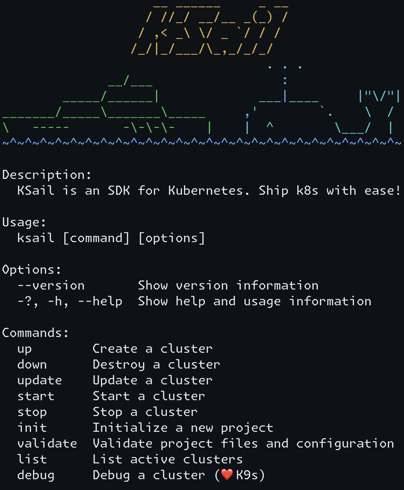

# KSail

[](https://opensource.org/licenses/Apache-2.0)
[](https://github.com/devantler-tech/ksail/actions/workflows/test.yaml)
[](https://codecov.io/gh/devantler-tech/ksail)

<p align="center">
  
</p>

## Getting Started

### Prerequisites

- MacOS (amd64 and arm64)
- Linux (amd64 and arm64)

### Installation

#### Homebrew

```sh
brew tap devantler-tech/formulas
brew install ksail
```

#### Manually

1. Download the latest release for your OS from the [releases page](https://github.com/devantler-tech/ksail/releases).
2. Make the binary executable: `chmod +x ksail`.
3. Move the binary to a directory in your `$PATH`: `mv ksail /usr/local/bin/ksail`.

### Usage

Getting started with KSail is straightforward. Begin by initializing a new KSail project:

```sh
> ksail init # to create a new default project

> ksail init \ # to create a new custom project
    --provider <Docker> \
    --distribution <Native|K3s> \
    --deployment-tool <Flux> \
    --cni <Default|Cilium> \
    --secret-manager <true|false>
```

This creates the following project files, depending on your choices:

- `kind.yaml` - Configuration for Kind.
- `k3d.yaml` - Configuration for K3d.
- `.sops.yaml` - Configuration for SOPS - the secret manager. (if Secret Manager is enabled)
- `k8s/kustomization.yaml` - A kustomize kustomization file acting as an entry point for your Kubernetes resources.

Customize these files to suit your setup. Once ready, create your cluster with:

```sh
> ksail up # to create the cluster
```

You can then modify your manifest files in the `k8s` folder as needed. To apply changes to your cluster, use:

```sh
> ksail update # to apply changes to the cluster
```

For advanced debugging, connect to the cluster via the [K9s](https://k9scli.io) tool with:

```sh
> ksail debug # to connect to the cluster
```

When you're done, you can stop the cluster to resume later:

```sh
> ksail stop # to shut down the cluster

> ksail start # to start the cluster again
```

Or completely remove it and its resources with:

```sh
> ksail down # to dismantle the cluster and all of its resources
```

For more details on the available commands, checkout the [KSail CLI Options](https://ksail.devantler.tech/docs/configuration/cli-options.html) page.

## Documentation

The documentation for KSail is available at [ksail.devantler.tech](https://ksail.devantler.tech).

## Sub-projects

KSail is part of a larger ecosystem of projects that I maintain. These projects are designed to provide important functionality to KSail with high confidence, and without bloating the main repository. Most the projects provide extensible frameworks, so you can build your own tools on top of them, or make contributions to make KSail even more powerful.

- **[devantler-tech/dotnet-container-engine-provisioner](https://github.com/devantler-tech/dotnet-container-engine-provisioner)** - Provisioners to provision resources in container engines like Docker or Podman.
- **[devantler-tech/dotnet-keys](https://github.com/devantler-tech/dotnet-keys)** - A library with key models, like the Age key model.
- **[devantler-tech/dotnet-kubernetes-generator](https://github.com/devantler-tech/dotnet-kubernetes-generator)** - Generators to create Kubernetes resources with `ksail init` and `ksail gen`.
- **[devantler-tech/dotnet-kubernetes-provisioner](https://github.com/devantler-tech/dotnet-kubernetes-provisioner)** - Provisioners to provision Kubernetes clusters and resources.
- **[devantler-tech/dotnet-kubernetes-validator](https://github.com/devantler-tech/dotnet-kubernetes-validator)** - A library that validates Kubernetes resources client-side or at runtime.
- **[devantler-tech/dotnet-secret-manager](https://github.com/devantler-tech/dotnet-secret-manager)** - A secret manager to manage secrets in Git in a secure way.
- **[devantler-tech/dotnet-template-engine](https://github.com/devantler-tech/dotnet-template-engine)** - A template engine to support code generation of non-serializable content.

### CLI Wrappers

These projects are CLI wrappers that provide a C# API for the respective CLI tools. They are used in KSail to embed and interact with CLI tools in a type-safe manner.

- **[devantler-tech/dotnet-age-cli](https://github.com/devantler-tech/dotnet-age-cli)** - A library that embeds and provides an API for the Age CLI.
- **[devantler-tech/dotnet-cilium-cli](https://github.com/devantler-tech/dotnet-cilium-cli)** - A library that embeds and provides an API for the Cilium CLI.
- **[devantler-tech/dotnet-flux-cli](https://github.com/devantler-tech/dotnet-flux-cli)** - A library that embeds and provides an API for the Flux CLI.
- **[devantler-tech/dotnet-helm-cli](https://github.com/devantler-tech/dotnet-helm-cli)** - A library that embeds and provides an API for the Helm CLI.
- **[devantler-tech/dotnet-k3d-cli](https://github.com/devantler-tech/dotnet-k3d-cli)** - A library that embeds and provides an API for the K3d CLI.
- **[devantler-tech/dotnet-k9s-cli](https://github.com/devantler-tech/dotnet-k9s-cli)** - A library that embeds and provides an API for the K9s CLI.
- **[devantler-tech/dotnet-kind-cli](https://github.com/devantler-tech/dotnet-kind-cli)** - A library that embeds and provides an API for the Kind CLI.
- **[devantler-tech/dotnet-kubeconform-cli](https://github.com/devantler-tech/dotnet-kubeconform-cli)** - A library that embeds and provides an API for the Kubeconform CLI.
- **[devantler-tech/dotnet-kubectl-cli](https://github.com/devantler-tech/dotnet-kubectl-cli)** - A library that embeds and provides an API for the Kubectl CLI.
- **[devantler-tech/dotnet-kustomize-cli](https://github.com/devantler-tech/dotnet-kustomize-cli)** - A library that embeds and provides an API for the Kustomize CLI.
- **[devantler-tech/dotnet-sops-cli](https://github.com/devantler-tech/dotnet-sops-cli)** - A library that embeds and provides an API for the SOPS CLI.

## Related Projects

KSail is a powerful tool that can be used in many different ways. Here are some projects that use KSail in their setup:

- **[devantler/homelab](https://github.com/devantler/homelab)** - My personal homelab setup.

If you use KSail in your project, feel free to open a PR to add it to the list, so others can see how you use KSail.

## Presentations

- **[KSail - a Kubernetes SDK for local GitOps development and CI](https://youtu.be/Q-Hfn_-B7p8?si=2Uec_kld--fNw3gm)** - A presentation on KSail at KCD2024.

## Star History

<picture>
  <source media="(prefers-color-scheme: dark)" srcset="https://api.star-history.com/svg?repos=devantler-tech/ksail&type=Date&theme=dark"/>
  <source media="(prefers-color-scheme: light)" srcset="https://api.star-history.com/svg?repos=devantler-tech/ksail&type=Date"/>
  
</picture>
