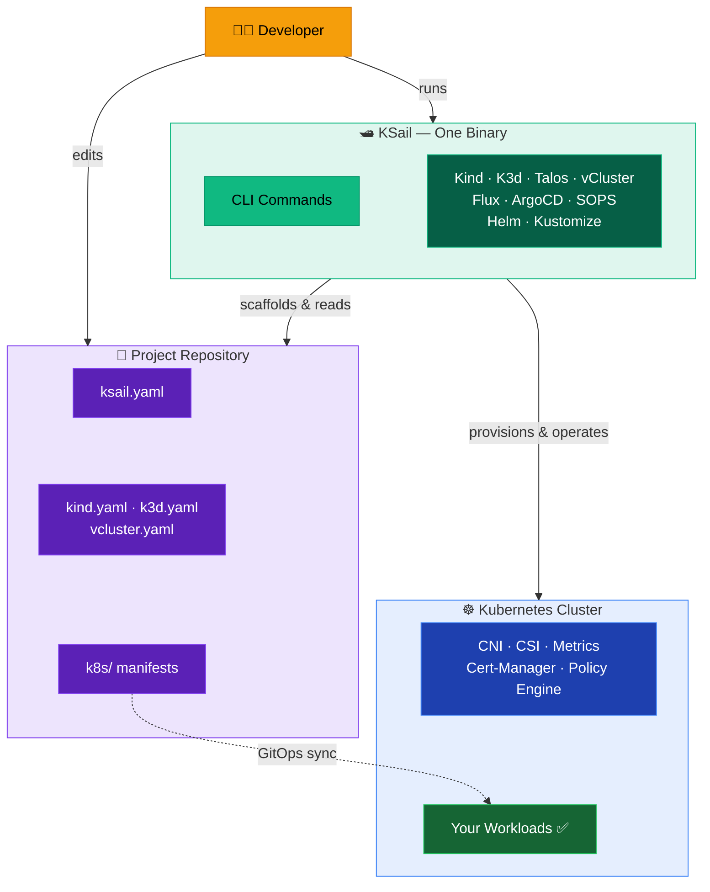

[](https://opensource.org/license/apache-2-0)
[](https://pkg.go.dev/github.com/devantler-tech/ksail/v5)
[](https://app.codecov.io/gh/devantler-tech/ksail)
[](https://github.com/devantler-tech/ksail/actions/workflows/ci.yaml)

# 🛥️🐳 KSail


KSail is a tool that bundles common Kubernetes tooling into a single binary. It provides a VSCode Extension, CLI, AI-Enabled Chat TUI or MCP interface to create clusters, deploy workloads, and operate cloud-native stacks across different distributions and providers.

## Why KSail?

Setting up and operating Kubernetes clusters often requires juggling multiple CLI tools, writing bespoke scripts, and dealing with inconsistent workflows. KSail removes the tooling overhead so you can focus on your workloads.

## Key Features

- 📦 **One Binary** — Embeds cluster provisioning, GitOps engines, and deployment tooling. No tool sprawl.
- ☸️ **Simple Clusters** — Spin up Vanilla, K3s, Talos, or VCluster clusters with one command. Same workflow across distributions.
- 🔓 **No Lock-In** — Uses native configs (`kind.yaml`, `k3d.yaml`, Talos patches, `vcluster.yaml`). Run clusters with or without KSail.
- 📥 **Mirror Registries** — Avoid rate limits, and store images once. Same mirrors used by different clusters.
- 📄 **Everything as Code** — Cluster settings, distribution configs, and workloads in version-controlled files.
- 🔄 **GitOps Native** — Built-in Flux or ArgoCD support with bootstrap, push, and reconcile commands.
- ⚙️ **Customizable Stack** — Select your CNI, CSI, policy engine, cert-manager, and mirror registries.
- 🔐 **SOPS Built In** — Encrypt, decrypt, and edit secrets with integrated cipher commands.
- 💾 **Backup & Restore** — Export cluster resources to a compressed archive and restore to any cluster with provenance labels.
- 🤖 **AI Assistant** — Interactive chat powered by GitHub Copilot for configuration and troubleshooting.
- 💻 **VSCode Extension** — Manage clusters from VSCode with wizards, sidebar views, and command palette.

## Getting Started

### Prerequisites

KSail works on all major operating systems and CPU architectures:

| OS                                            | Architecture |
|-----------------------------------------------|--------------|
| 🐧 Linux                                      | amd64, arm64 |
|  macOS                                       | arm64        |
| ⊞ Windows (native untested; WSL2 recommended) | amd64, arm64 |

**Docker is required** for local clusters. Install Docker Desktop/Engine and ensure `docker ps` works.

Supported distributions run on different infrastructure providers:

| Provider | Vanilla  | K3s     | Talos | VCluster |
|----------|----------|---------|-------|----------|
| Docker   | ✅ (Kind) | ✅ (K3d) | ✅     | ✅ (Vind) |
| Hetzner  | —        | —       | ✅     | —        |
| Omni     | —        | —       | ✅     | —        |

### Installation

See the [Installation Guide](https://ksail.devantler.tech/installation/) for detailed installation instructions.

#### VSCode Extension

For VSCode users, install the [KSail extension](https://marketplace.visualstudio.com/items?itemName=devantler.ksail) to manage clusters directly from your editor. See the [extension documentation](vsce/README.md) for features and usage.

## Usage


```mermaid
flowchart TD
    Dev["🧑‍💻 Developer"]

    Dev -->|"edits"| Project
    Dev -->|"runs"| KSail

    subgraph Project ["📁 Project Repository"]
        Config["ksail.yaml"] ~~~ DistConfig["kind.yaml · k3d.yaml<br/>vcluster.yaml"] ~~~ Manifests["k8s/ manifests"]
    end

    KSail -->|"scaffolds & reads"| Project
    KSail -->|"provisions & operates"| Cluster

    subgraph KSail ["🛥️ KSail — One Binary"]
        CLI["CLI Commands"] ~~~ Tools["Kind · K3d · Talos · vCluster<br/>Flux · ArgoCD · SOPS<br/>Helm · Kustomize"]
    end

    subgraph Cluster ["☸️ Kubernetes Cluster"]
        Infra["CNI · CSI · Metrics<br/>Cert-Manager · Policy Engine"] ~~~ Workloads["Your Workloads ✅"]
    end

    Manifests -.->|"GitOps sync"| Workloads

    style Dev fill:#f59e0b,stroke:#d97706,color:#000
    style Project fill:#7c3aed22,stroke:#7c3aed
    style KSail fill:#10b98122,stroke:#10b981
    style Cluster fill:#3b82f622,stroke:#3b82f6
    style CLI fill:#10b981,stroke:#059669,color:#000
    style Tools fill:#065f46,stroke:#10b981,color:#fff
    style Infra fill:#1e40af,stroke:#3b82f6,color:#fff
    style Workloads fill:#166534,stroke:#22c55e,color:#fff
    style Config fill:#5b21b6,stroke:#7c3aed,color:#fff
    style DistConfig fill:#5b21b6,stroke:#7c3aed,color:#fff
    style Manifests fill:#5b21b6,stroke:#7c3aed,color:#fff
```

```bash
# 1. Initialize a new project with your preferred stack
ksail cluster init \
  --name <cluster-name> \
  --profile <Default> \
  --distribution <Vanilla|K3s|Talos|VCluster> \
  --cni <Default|Cilium|Calico> \
  --csi <Default|Enabled|Disabled> \
  --metrics-server <Default|Enabled|Disabled> \
  --cert-manager <Enabled|Disabled> \
  --policy-engine <None|Kyverno|Gatekeeper> \
  --gitops-engine <None|Flux|ArgoCD> \
  --mirror-registry <host>=<upstream>

# 2. Create and start the cluster
ksail cluster create

# 3. Add your manifests to the k8s/ directory

# 4. Deploy your workloads
ksail workload apply -k ./k8s   # kubectl workflow
ksail workload reconcile        # gitops workflow

# 5. Update cluster configuration (modify ksail.yaml, then run)
ksail cluster update            # Apply configuration changes

# 6. Connect to the cluster with K9s
ksail cluster connect
```

### Native Configuration Files

KSail generates standard distribution configuration files that you can use directly with the underlying tools:

```bash
# After ksail cluster init, you'll find native configs:
# - kind.yaml       (for Vanilla/Kind clusters)
# - k3d.yaml        (for K3s clusters)
# - talos/          (for Talos clusters)
# - vcluster.yaml   (for VCluster clusters)

# You can use these configs directly without KSail:
kind create cluster --config kind.yaml
k3d cluster create --config k3d.yaml
talosctl cluster create --config-patch @talos/cluster/patches.yaml
vcluster create my-cluster --values vcluster.yaml

# Or let KSail manage the lifecycle:
ksail cluster create
```

## Documentation

Browse the documentation at <https://ksail.devantler.tech> (GitHub Pages)

## Contributing

Contributions are welcome! Please read [CONTRIBUTING.md](CONTRIBUTING.md) for details on our development process, coding standards, and how to submit pull requests.

## Related Projects

KSail is a powerful tool that can be used in many different ways. Here are some projects that use KSail in their setup:

| Project                                                               | Description         | Type     |
|-----------------------------------------------------------------------|---------------------|----------|
| [devantler-tech/platform](https://github.com/devantler-tech/platform) | My personal homelab | Platform |

If you use KSail in your project, feel free to open a PR to add it to the list, so others can see how you use KSail.

## Presentations

- **[KSail - a Kubernetes SDK for local GitOps development and CI](https://youtu.be/Q-Hfn_-B7p8?si=2Uec_kld--fNw3gm)** - A presentation on KSail at KCD2024 (Early version of KSail that was built in .NET).

## Blog Posts

- [Local Kubernetes Development with KSail and Kind](https://devantler.tech/blog/local-kubernetes-development-with-ksail-and-kind/)
- [Local Kubernetes Development with KSail and K3d](https://devantler.tech/blog/local-kubernetes-development-with-ksail-and-k3d/)
- [Local Kubernetes Development with KSail and Talos](https://devantler.tech/blog/local-kubernetes-development-with-ksail-and-talos/)
- [Creating Kubernetes Clusters on Hetzner with KSail and Talos](https://devantler.tech/blog/creating-development-kubernetes-clusters-on-hetzner-with-ksail-and-talos/)
- [AI-first TUI for KSail with Copilot SDK and Bubbletea](https://devantler.tech/blog/building-an-ai-assistant-for-kubernetes-with-github-copilot-sdk/)

## Star History

<a href="https://www.star-history.com/#devantler-tech/ksail&type=timeline&legend=top-left">
 <picture>
   <source media="(prefers-color-scheme: dark)" srcset="https://api.star-history.com/svg?repos=devantler-tech/ksail&type=timeline&theme=dark&legend=top-left" />
   <source media="(prefers-color-scheme: light)" srcset="https://api.star-history.com/svg?repos=devantler-tech/ksail&type=timeline&legend=top-left" />
   
 </picture>
</a>
