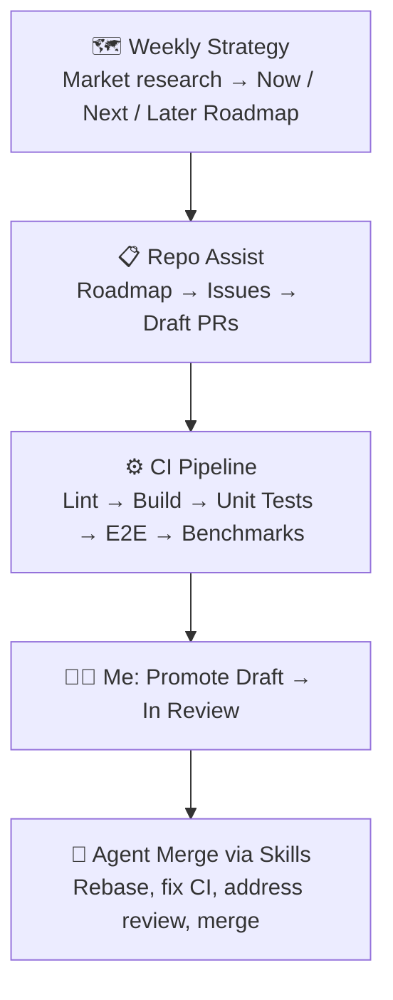
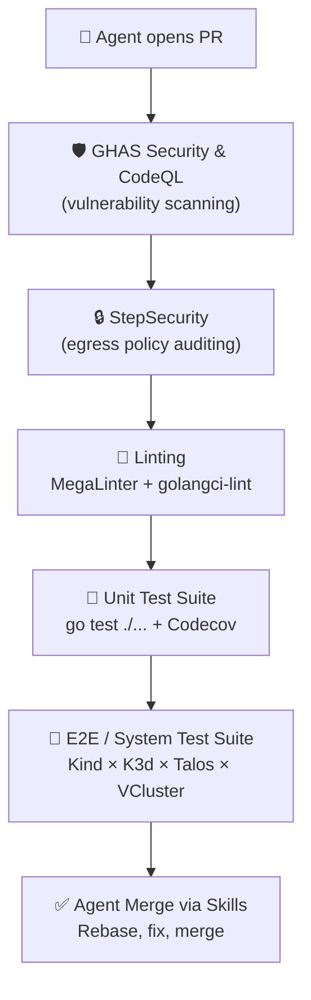

<!-- _class: lead -->

# 🤖 Autonomous OSS Development with GitHub Agentic Workflows

## How KSail runs itself — and I just review PRs

---

# What is KSail?

A **Go CLI** and SDK for spinning up local Kubernetes clusters with GitOps built in.

- Embeds kubectl, helm, kind, k3d, vcluster, flux, argocd as **Go libraries**
- Only requires **Docker** — no tool installation
- Supports Vanilla, K3s, Talos, and VCluster distributions

> 💡 One binary, full local GitOps — from `ksail cluster init` to a running cluster.

---

# The Agentic Workflow Pipeline

| Layer | Workflow | Schedule | What it does |
|-------|----------|----------|-------------|
| **Strategy** | Weekly Strategy | Mon / Wed | Roadmap, competitive analysis, content |
| **Planning** | Repo Assist | Every 12h | Translates roadmap → issues → PRs |
| **Docs** | Daily Docs | Daily | Syncs documentation with code changes |
| **Infra** | Workflow Maintenance | Daily | Updates CI, optimizes workflows |
| **Safety** | CI Doctor | On failure | Investigates CI failures, files issues |
| **Cleanup** | Agentics Maintenance | Every 2h | Expires stale discussions, issues, PRs |

---

# How It All Connects

---

# AI Guardrails

*Every layer must pass before an agent PR can merge.*

---

# My Role: Minimal but Intentional

🖥️ A **Mac Mini runs 24/7 at home**, firing scheduled prompts that trigger agents to work on KSail autonomously.

### What I actually do:

- ✅ **Promote PRs** from Draft → In Review *(the main gate)*
- 👀 **Occasional check-ins** to review agent decisions
- 🛠️ **Build things myself** when I want to — I hook into the same process

### What the agents handle:

- 🗺️ Roadmap creation and competitive analysis
- 📋 Issue creation and prioritization
- 💻 Code changes, tests, and documentation
- 🔄 CI failure investigation and resolution
- 🧹 Stale content cleanup

> The workflow is designed so **nothing merges without my approval**.

---

<!-- _class: lead -->

# 🚀 The Result

## A single developer maintaining a complex Kubernetes tool
## with an army of autonomous agents — and a Mac Mini.

**github.com/devantler-tech/ksail**
