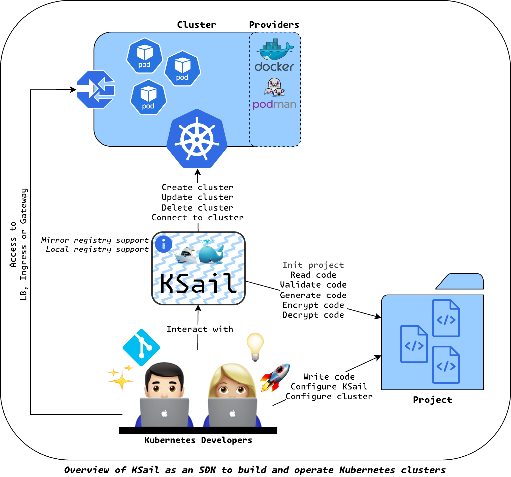

# KSail Documentation

KSail is a CLI tool for managing Kubernetes clusters and workloads. Built in Go, it provides a unified interface for cluster lifecycle management and wraps common Kubernetes tools behind consistent commands.

## Documentation

- **[Declarative Configuration](declarative-configuration.md)** – Declarative config
- **[CLI Flags Reference](cli-flags/root.md)** – Complete CLI flags documentation for all commands
- **[Use Cases](use-cases.md)** – Workflows for learning, development, and CI/CD
- **[Core Concepts](core-concepts.md)** – CNI, CSI, registries, and components

## Quick Links

- **Installing?** See [github.com/devantler-tech/ksail](https://github.com/devantler-tech/ksail#installation)
- **Issues?** Open an [issue](https://github.com/devantler-tech/ksail/issues) in the repository
- **Questions?** Start a [discussion](https://github.com/devantler-tech/ksail/discussions) in the repository
