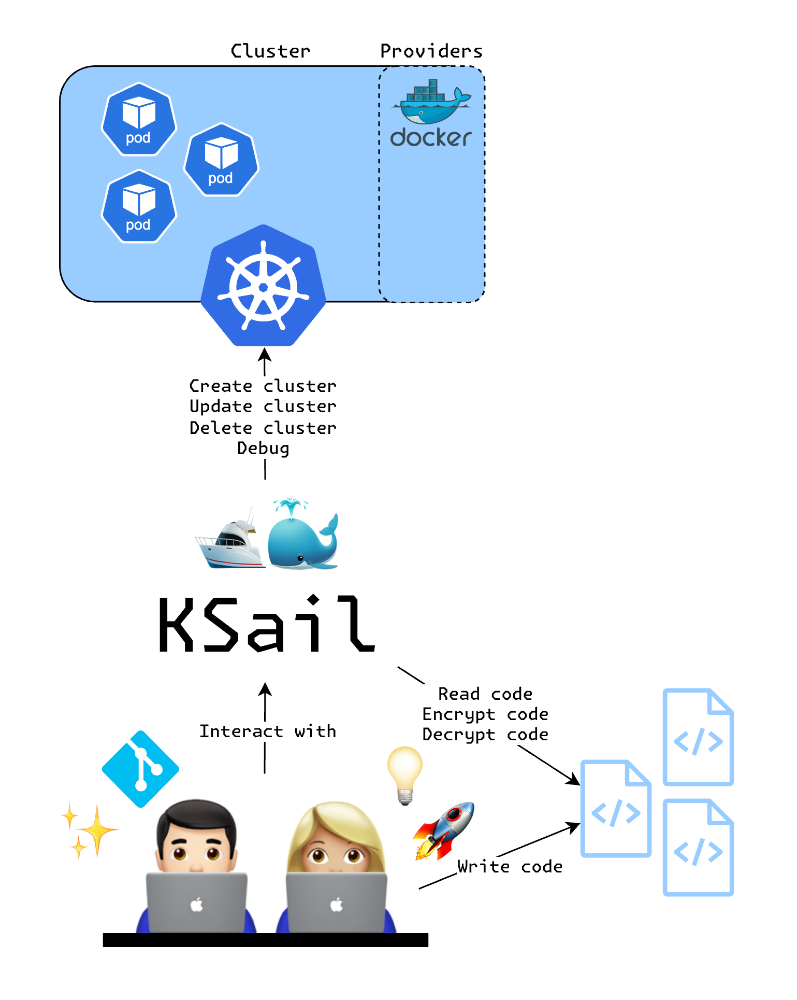

# Overview

KSail is a CLI tool for managing local Kubernetes clusters and workloads. Rewritten in Go, it provides a unified interface for cluster lifecycle management and wraps common Kubernetes tools behind consistent commands.

## Who Uses KSail?

KSail is built for platform engineers, developers, and anyone working with Kubernetes who wants a fast feedback loop. The CLI provides a consistent interface across different distributions, making it approachable for engineers learning Kubernetes.

## What You Can Do with KSail

- **Scaffold projects** – `ksail cluster init` creates a project with configuration files and Kustomize structure
- **Manage clusters** – Use `ksail cluster` subcommands (`create`, `start`, `stop`, `delete`, `info`, `list`, `connect`) to manage Kind or K3d clusters
- **Work with manifests** – `ksail workload` commands wrap `kubectl` and Helm for applying and managing workloads
- **Generate resources** – `ksail workload gen` helps create Kubernetes resource manifests
- **Encrypt secrets** – `ksail cipher` wraps SOPS for encrypting and decrypting files

## Navigating the Documentation

- [Project structure](project-structure.md) explains repository organization and Kustomize usage
- [Support matrix](support-matrix.md) lists currently supported features and platforms
- [Core concepts](core-concepts/) describes CNI, distributions, storage, and other building blocks
- [Configuration guides](../configuration/) detail CLI flags and YAML structure
- [Use-case playbooks](../use-cases/) provide guided workflows

> **Note:** KSail is being rewritten in Go. Some features from the previous .NET version are still being reimplemented.
