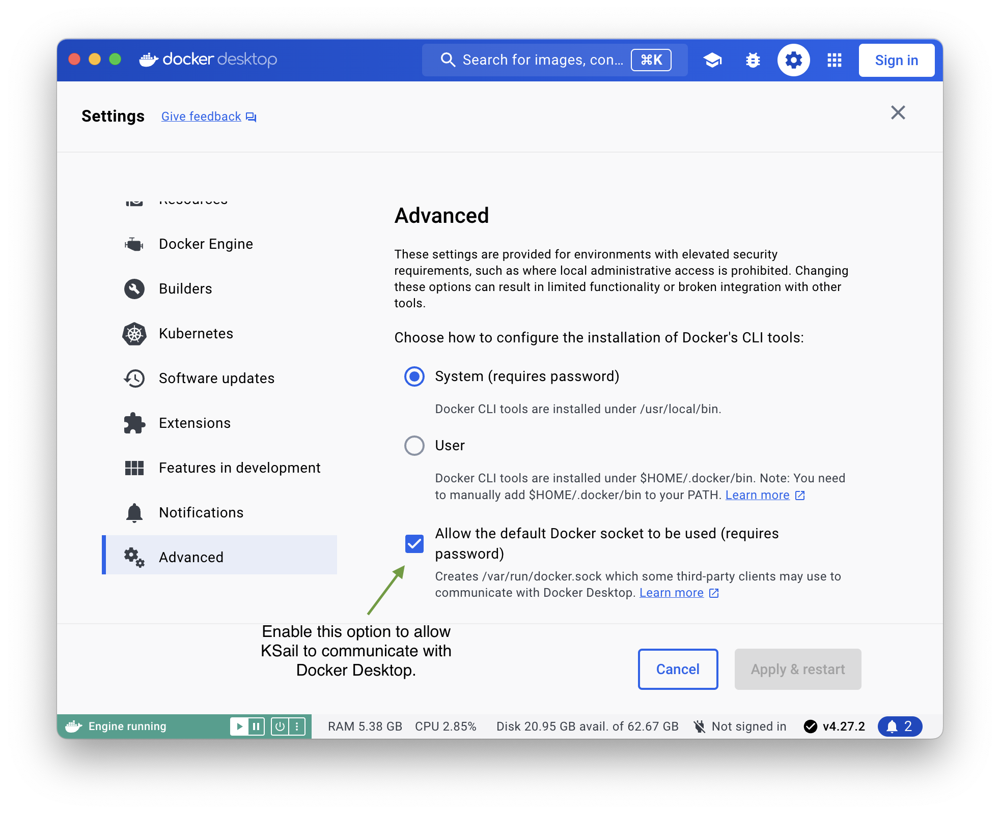

## Support Matrix

KSail aims to support a wide range of use cases by providing the flexibility to run popular Kubernetes distributions on various local, on-prem, and cloud engines. Below is a detailed support matrix.

<table>
  <thead>
    <tr>
      <th>Category</th>
      <th>Support</th>
    </tr>
  </thead>
  <tbody>
    <tr>
      <td><strong>Operating Systems</strong></td>
      <td>
        Linux (arm64), Linux (amd64), 
        macOS (arm64), macOS (amd64)
      </td>
    </tr>
    <tr>
      <td><strong>Providers</strong></td>
      <td><a href="https://www.docker.com">Docker</a></td>
    </tr>
    <tr>
      <td><strong>Kubernetes Distributions</strong></td>
      <td>
        <a href="https://kind.sigs.k8s.io">Native</a>,
        <a href="https://k3d.io">K3s</a>
      </td>
    </tr>
    <tr>
      <td><strong>Deployment Tools</strong></td>
      <td><a href="https://fluxcd.io">Flux</a></td>
    </tr>
    <tr>
      <td><strong>Secret Management</strong></td>
      <td>
        <a href="https://github.com/getsops/sops">SOPS</a>
      </td>
    </tr>
    <tr>
      <td><strong>Container Network Interfaces (CNI)</strong></td>
      <td>
        Default,
        <a href="https://cilium.io">Cilium</a>
      </td>
    </tr>
    <tr>
      <td><strong>Client-Side Validation</strong></td>
      <td>
        Configuration,
        <a href="https://github.com/aaubry/YamlDotNet">YAML syntax</a>,
        <a href="https://github.com/yannh/kubeconform">Schema </a>
      </td>
    </tr>
  </tbody>
</table>

If you would like to see additional tools supported, please open an issue or pull request on [GitHub](https://github.com/devantler-tech/ksail).

> [!NOTE]
> The  `Docker` option in the `Provider` category requires access to the default Docker socket. You might need to "Allow the default Docker socket to be used (requires password)" in the Docker Desktop settings.
>
> 

Show me how

>
> 
>
> 

> [!NOTE]
> The actual distribution used is determined by the `Provider` and `Kubernetes Distributions` options you select.
>
> - Docker + Native = [kind](https://kind.sigs.k8s.io)
> - Docker + K3s = [k3d](https://k3d.io)

> [!NOTE]
> The `Default` option in the `Container Network Interfaces (CNI)` category refers to the default CNI provided by the Kubernetes distribution you are using.
>
> - Kind uses [kindnetd](https://github.com/kubernetes-sigs/kind/tree/main/images/kindnetd)
> - K3d uses [flannel](https://github.com/flannel-io/flannel)
