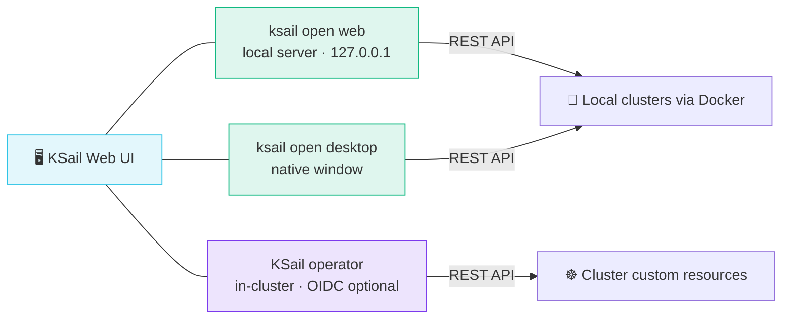

import { TabItem, Tabs } from "@astrojs/starlight/components";

KSail ships one web UI that runs in three places: locally in your browser, as a native desktop window, or inside a cluster served by the [KSail operator](/guides/operator/). All three talk to the same REST API, so the experience is identical — pick the surface that fits how you work.



## Choosing a Surface

| Surface | Command | Best for |
|---------|---------|----------|
| Browser | `ksail open web` | Quick visual management of local clusters without installing anything extra |
| Desktop app | `ksail open desktop` | A dedicated window outside the browser, launchable from your dock |
| In-cluster | Helm chart with `ui.enabled=true` | Team-shared dashboards over [operator-managed clusters](/guides/operator/), with optional OIDC sign-in |

## Running Locally

<Tabs>
  <TabItem label="Browser (ksail open web)">
    `ksail open web` starts a small local web server and opens the UI in your browser. The server binds to `127.0.0.1` only — it is never exposed to your network — and serves both the UI and a REST API backed by your local cluster lifecycle. It runs until you press <kbd>Ctrl</kbd>+<kbd>C</kbd>.

    ```bash
    ksail open web              # pick a free port and open the browser
    ksail open web --port 8080  # serve on a fixed port
    ksail open web --no-browser # start the server without opening a browser
    ```

    This is the same UI the KSail operator serves in-cluster, but here it provisions and manages clusters locally via Docker.
  </TabItem>
  <TabItem label="Desktop app (ksail open desktop)">
    The desktop app wraps the web UI in a native window — no browser required. It ships as a separate download from the [releases page](https://github.com/devantler-tech/ksail/releases), or build it from source with `make desktop`.

    ```bash
    ksail open desktop
    ```

    `ksail open desktop` launches the app from, in order: a `ksail-desktop` binary next to the `ksail` executable, the same binary on your `PATH`, or (on macOS) an installed **KSail** app.
  </TabItem>
  <TabItem label="In-cluster (operator)">
    Enable the UI when installing the [KSail operator](/guides/operator/) Helm chart:

    ```bash
    helm upgrade --install ksail-operator oci://ghcr.io/devantler-tech/charts/ksail-operator \
      --namespace ksail-system --create-namespace \
      --set ui.enabled=true
    ```

    The in-cluster UI manages `Cluster` custom resources instead of local Docker containers, and supports OIDC authentication and a server-enforced read-only mode. See [Kubernetes Operator](/guides/operator/) for the full setup.
  </TabItem>
</Tabs>

## Read-Only Mode for GitOps

In GitOps-enforced environments the Git repository should stay the single source of truth. Deploy the in-cluster UI with `ui.readOnly=true` to lock it to inspection: the restriction is enforced server-side by the REST API, not just hidden in the frontend.

> [!NOTE]
> The operator's REST API is unauthenticated by default. Enable OIDC (`auth.oidc.enabled=true`) to require sign-in, or set `api.bindPort=0` to disable the API entirely when you don't need the UI. The local `ksail open web` server avoids this concern by binding to `127.0.0.1` only.

## CLI Reference

[`ksail open web`](/cli-flags/open/open-web/), [`ksail open desktop`](/cli-flags/open/open-desktop/)

## Related

- [Kubernetes Operator](/guides/operator/) — deploy the UI in-cluster with OIDC and read-only mode
- [OIDC Authentication](/guides/oidc-authentication/) — KSail's native OIDC support for cluster access
- [VSCode Extension](/integrations/vscode-extension/) — manage clusters from your editor instead
